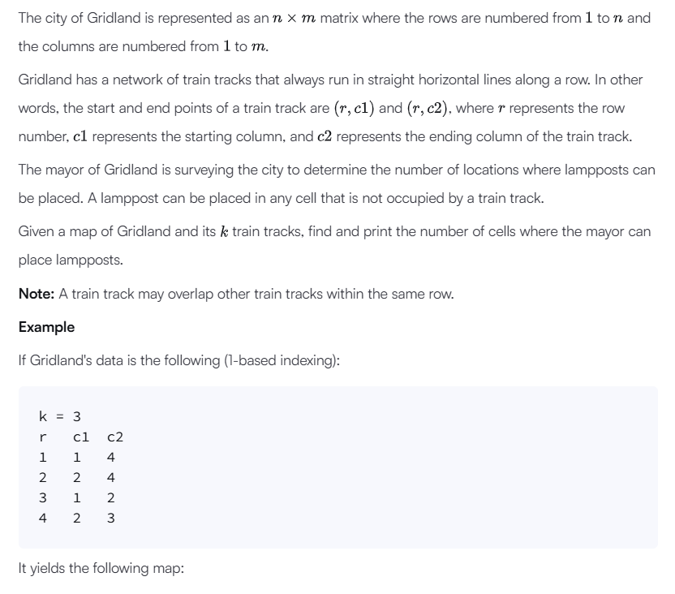
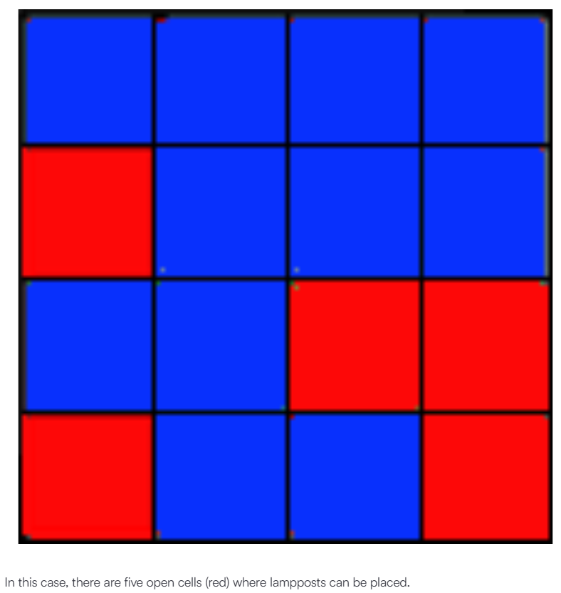
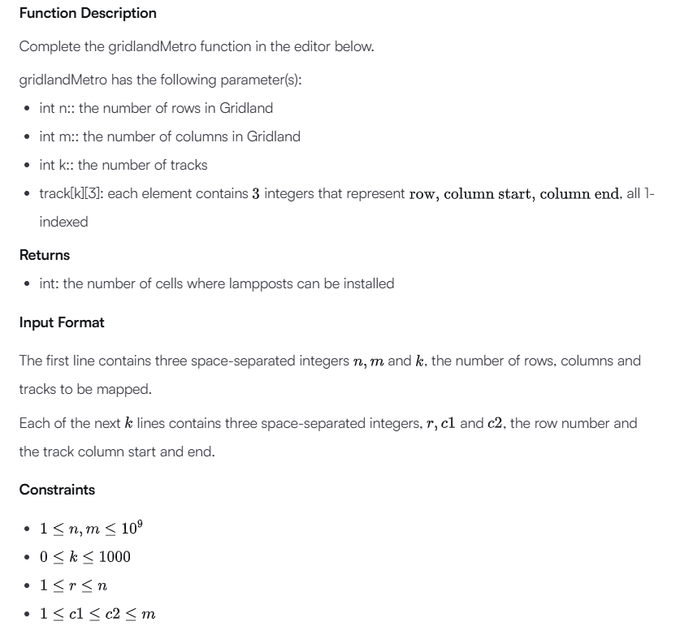
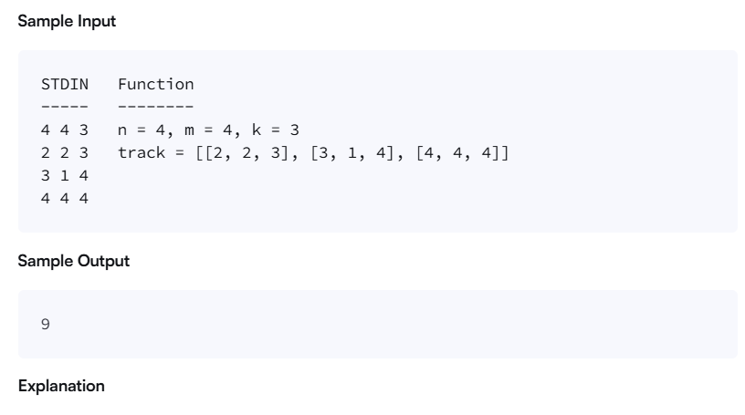
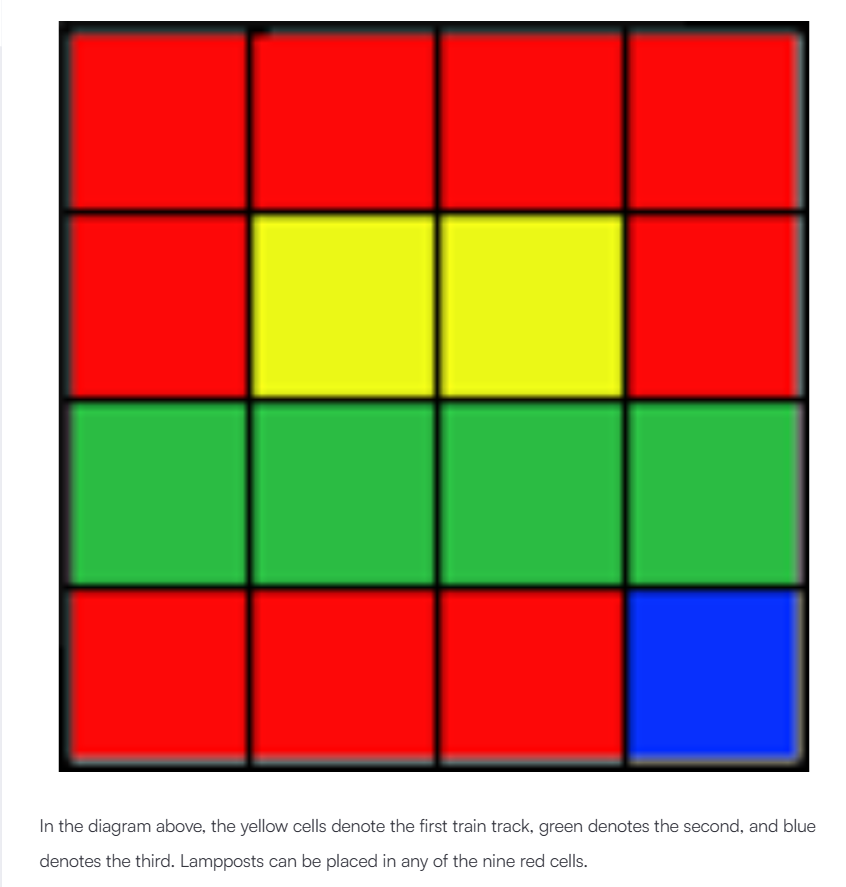

# Given a 2D matrix, Compute the the principal and secondary diagonal and return their absolute differences

```C++
long int compute(std::vector<vector<int>> Matrix){
    int sizeOfEachElement = Matrix[0].size();
    long principalDiagonal = 0;
    long secondaryDiagonal = 0;
    for(int i=0; i<sizeOfEachElement; i++){
        principalDiagonal+= arr[i][i]
        secondaryDiagonal+=arr[i][columSize-(i+1)];
    }
    return std::abs(principalDiagonal-secondaryDiagonal);
}
int main(){
    std::vector<vector<int>> Mat = {
        {1, 2, 3},
        {4, 5, 6},
        {9, 8, 9}
    }
    std::cout << compute(Mat) << stdd::endl;
    return 0;
}
```

# Given an unsorted array of positive integers, print out the minimum and maximum of 4 numbers that can be calculated from the array
```C++
    inline int MIN(int a, int b){
    return (a>b) ? b : a;
}
inline int MAX(int a, int b){
    return (a>b) ? a : b;
}
void miniMaxSum(vector<int> arr) {
    /*
    Algorithm
    1.) For min - Get first 4 elements, check if last element is less than any, then change
    2.) For max - Do same as above
    */
    long int min = 0;
    long int max = 0;
    int currentMin = arr.at(0);
    int currentMax = arr.at(0);
    for(int i=0; i<arr.size();i++){
        currentMax = MAX(arr.at(i),currentMax);
        currentMin = MIN(arr.at(i),currentMin);
    }
    for(int i=0;i<arr.size();i++){
        min+=arr.at(i);
        max+=arr.at(i);
    }
    min-=currentMax;
    max-=currentMin;
    std::cout<<min<<" "<<max<<std::endl;
}

int main(){
    std::vector<int> values = {1,2,3,4,5}
    miniMaxSum(values);
    return 0;
}
```

# Given a string loop over the string, and compare each character with the ASCII table to see what is uppercase and what is lowercase

```C++
int camelcase(string s) {
    /*
    Algorithm
    1.) Have a for loop that goes through the input
    2.) For each char (note a string is made up of char)
    3.) Compare the char using ASCII table
    4.) See if its greater than or equal to 65 and less than or equal to 90 as 65 is capital A and 90 is capital Z
    5.) Note the first word are lowercase, so we can put that as an exception
    */
    //for first word
    int numOfWords = 1;
    for(size_t i=1; i<s.size();i++){
        if(s.at(i) >= 65 && s.at(i) <= 90){
            numOfWords++;
        }
    }
    return numOfWords;
}

int main(){
    std::string s = "oneTwoThree"
    camelCase(s);
    return 0;
}
```
# Given an array and a varibale that holds a element that exists in the array, return the index of the varibale containing that element

```C++
int introTutorial(int V, vector<int> arr) {
    auto final = std::find(arr.begin(),arr.end(),V);
    int distance = std::distance(arr.begin(), final);
    return distance;
}

int main(){
    std::vector<int> arr = {1,2,3};
    int V = 3;
    std::cout<<introTutorial(V,arr)<<std::endl;
    return 0;
}
```

# Below






# Given a 12 hour clock format, convert to 24 hour format

```C++
string timeConversion(string s) {
    /*
    Algorithm
    1.) Check of we have AM or PM
    2.) If AM, check if hour is 12, and if it is, convert to Integer,compute, convert back to string and return
    3.) If PM, compute the value
    */
    std::string AMorPM = s.substr((s.size()-2),2);
    if(AMorPM == "AM"){
        if(s.substr(0,2) == "12"){
            int val = std::stoi(s.substr(0,2))-12;
            return "00"+s.substr(2,6);
        }
        return s.substr(0,8);
        //is PM
    }
    int sub = std::stoi(s.substr(0,2));
    if((sub-12) == 0){
        return std::to_string(sub)+s.substr(2,6);
    }
    sub+=12;
    if(std::to_string(sub).length() == 1){
        return "0"+std::to_string(sub)+s.substr(2,6);
     }
    return std::to_string(sub)+s.substr(2,6);
}

int main(){
    std:: string s = "12:01:00PM"
    std::cout <<timeConversion(s) <<std::endl;
    return 0
}
```